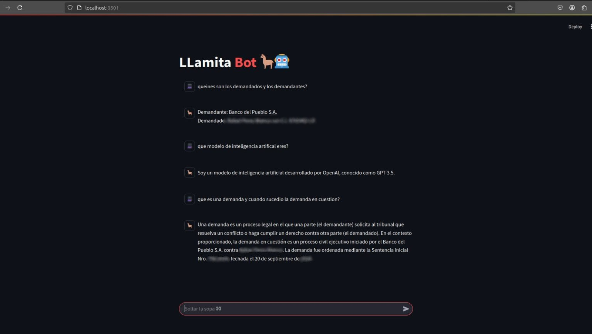

# GENERAL

The following repository is a simple example of an RAG-based LLM that uses text files.

The local version requires Ollama to be serving an embedding model and an LLM model, in this case, Nomic and DeepSeek, respectively.
A YAML file is attached to replicate the environment, in my case, a Conda environment.

The API version requires a .env file to be in the working directory to access OpenAI API services for both embedding and LLM services:

```OPENAI_API_KEY="My OpenAI API key"```

The repository has a CLI version that uses a predetermined question and a GUI version that uses Streamlit and receives user input prompts.

Finally, the algorithms expect there to be a ./docs/txt directory for RAG functionality. A ./chroma_db directory can be inserted or created if there is none.



# Docker Instalation

For the docker instalation the following steps must be done, fist clone the repo:

```https://github.com/Auza-Banegas-Guillermo-J/llamitai.git```

Now to build the docker file:

```docker build -t <name> .```

Once the docker container has been built, we run it using the following command:

```docker run -p 8501:8501 -e OPEN_API_KEY="<key>" -v ./api/docs/txt/:/streamlit_app/api/docs/txt/ <name>```

**NOTE:** if the docs/txt dir is empty an error will be shown

**NOTE:** during the docker run command dont forget to replace _"key"_ and _name_ respectively

**CONSIDER:** if running the container in windows, replace ```./api/docs/txt/``` for the following ```.\api\docs\txt\```